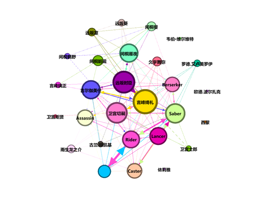
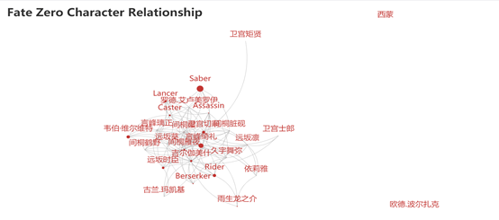

# 《Fate/Zero》小说人物关系分析

​		分词统计《Fate/Zero》小说中人物出现的次数，为了能够得到小说中的人物关系，需要下载原著小说对其进行分词处理，得到其中的各个人物名称，同时统计其在一出现的次数。统计人物出现频次时，还需要处理剧情中人物的简称或者昵称。为了简化模型，对于人物的关系，默认为在一个段落中出现可认为有关系。同时，为了加快处理速度，我们还需要准备一个废弃词的词典，遇到这些词时可以直接跳过，节省时间。

综上，一共需要准备以下四个文件：

- Fate_Zero.txt 原著小说

- character.txt 人名字典

-  alias.txt 人名别称对照

- discarded.txt 废弃词字典

开发环境：

- Python3.7

-  Jieba 分词

- Pyecharts 绘图

- Gephi软件 用于展示人物关系，需要依赖Java环境

-------------------------------------

